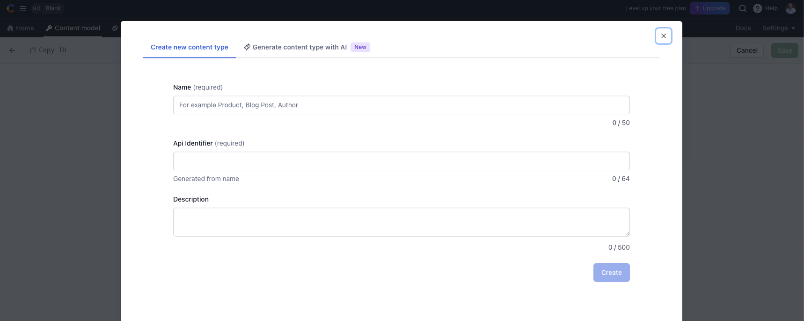

# Contentful

[Contentful ](https://www.contentful.com/)

## Create Data

Setup content type and create few entries

### Create `projects` Content Type

- Click on "Create content type" button



- Add 3 fields to the content type
  - title - Short text
  - url - Short text
  - image - Media (required)

### Create API Keys

- Settings -> API keys -> click "Add API key" button

---

## Install Contentful SDK

```sh
npm install contentful
```
