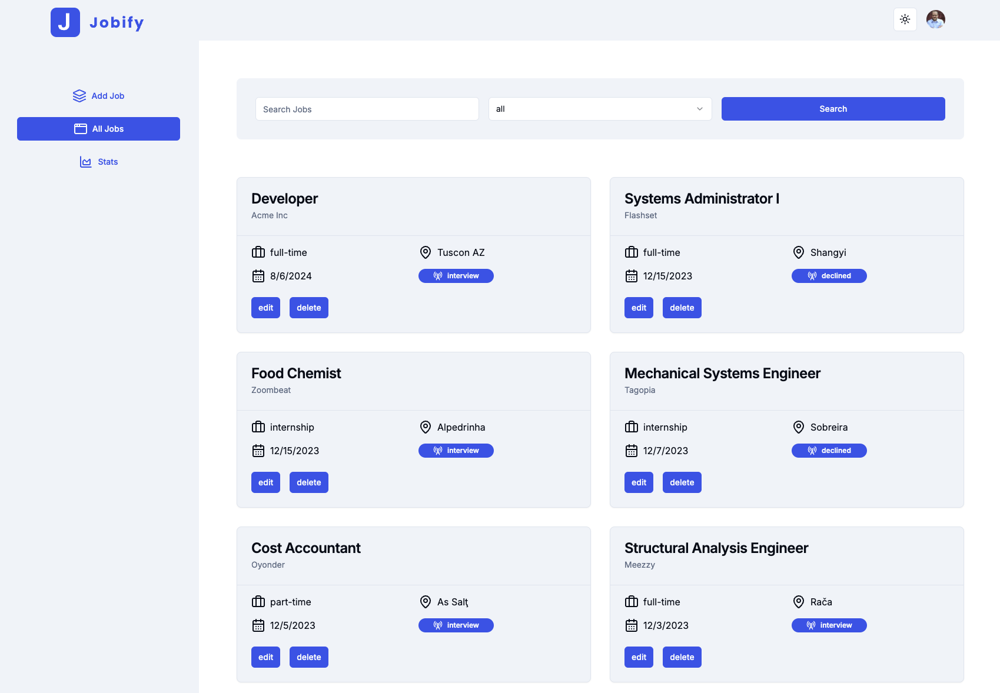
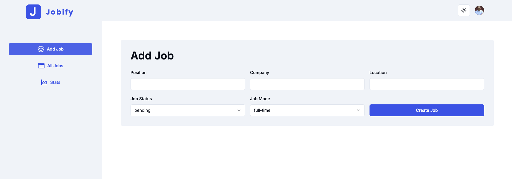
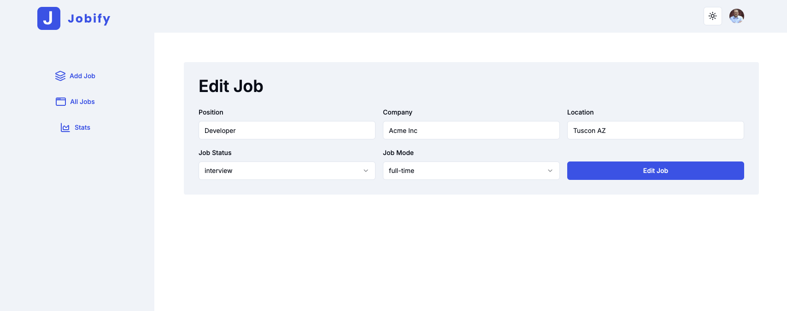
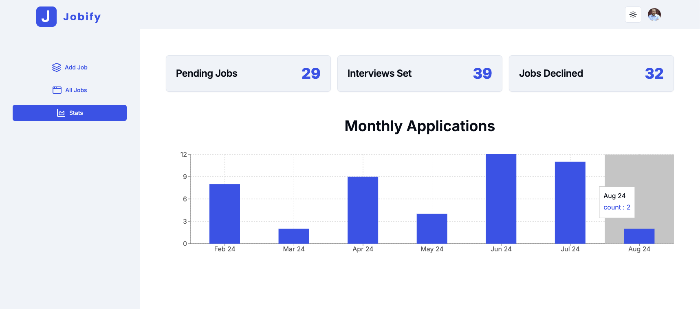

# Next Jobify

A jobs application written in NextJS with TypeScript.

### List All Jobs



### Add Job



### Edit Job



## Charts



---

- [Clerk](https://www.clerk.com/) for User Management & Authentication
- [Supabase](https://supabase.com/) for Database Management (Postgres)
- [Prisma](https://www.prisma.io/) for ORM
- [Shadcn](https://ui.shadcn.com/) for Components & Themeing
- [TailwindCSS](https://tailwindcss.com/) for Styles
- [recharts](https://recharts.org/en-US/) for graphs and charts
- [Zod](https://zod.dev/) for schema validation for forms

---

## Getting Started

1. Clone this repository.

2. Install dependencies

```bash
npm i
```

3. Run the development server:

```bash
npm run dev
```

---

## Seeding the database

In the `prisma/seed.js` file change the clerkId to your users clerkId.

### Run the seed script

```bash
node prisma/seed.js
```


