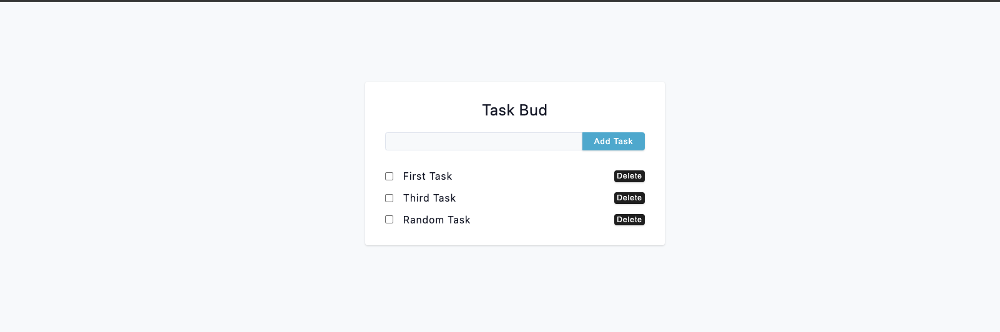

# React Query Tasks
A simple tasks application written in React with Tanstack Query to interact with the data.



## Run the API

```sh
cd server/
npm install
npm run local-server
```
The local server saves data to a json file so its persisted across server restarts.

Alernatively you can use:

```sh
npm run start
```

<http://localhost:9000/api/tasks>

---
## Run the Client

```sh
cd client/
npm install
npm run start
```

<http://localhost:5173>

(This may be different for you, it depends on what Vite is using on your machine.)

---


